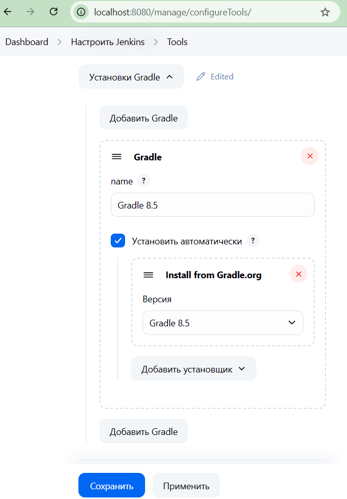
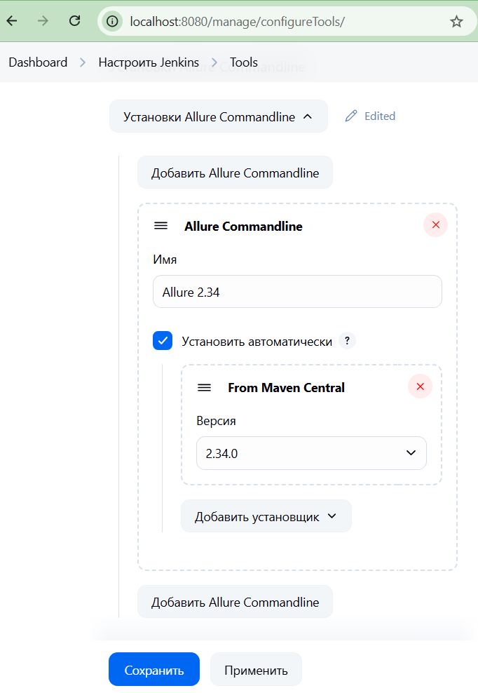

# 🔧 UI & API Test Automation with Jenkins + Selenium Grid (Java)

Этот проект позволяет запускать UI и API тесты на Java через Jenkins и Selenium Grid, развёрнутые локально с помощью Docker Compose.

---
## 📦 Состав
- `Jenkins` (8080)
- `Selenium Grid Hub` (4444)
- `Chrome Node`
- Docker-сеть для взаимодействия
---

## 🚀 Запуск окружения
> Убедись, что установлен Docker и Docker Compose.
```bash
docker-compose up -d
```
```bash
docker-compose down
```
Подожди 15–30 секунд.

Теперь доступны:
* Jenkins: http://localhost:8080
* Selenium Grid UI: http://localhost:4444/ui/

## Альтернативный способ запуска Jenkins через Dockerfile
Если ты хочешь собрать кастомный образ Jenkins с установленным Chrome и Docker CLI (например, для запуска UI тестов и управления контейнерами прямо из Jenkins), можно использовать следующий Dockerfile.

```dockerfile
FROM jenkins/jenkins:lts-jdk17

USER root

# Обновление пакетов и установка lsb-release, зависимостей Chrome и утилит
RUN apt-get update && \
    apt-get install -y \
    lsb-release \
    apt-transport-https \
    ca-certificates \
    curl \
    gnupg \
    && rm -rf /var/lib/apt/lists/*

# Установка Google Chrome
RUN curl -LO https://dl.google.com/linux/direct/google-chrome-stable_current_amd64.deb && \
    apt-get update && \
    apt-get install -y ./google-chrome-stable_current_amd64.deb && \
    rm google-chrome-stable_current_amd64.deb

# Проверка версии Chrome
RUN google-chrome --version

# Добавление репозитория Docker и установка docker-ce-cli
RUN install -m 0755 -d /etc/apt/keyrings && \
    curl -fsSL https://download.docker.com/linux/debian/gpg | gpg --dearmor -o /etc/apt/keyrings/docker.gpg && \
    echo "deb [arch=$(dpkg --print-architecture) signed-by=/etc/apt/keyrings/docker.gpg] https://download.docker.com/linux/debian $(lsb_release -cs) stable" \
    > /etc/apt/sources.list.d/docker.list && \
    apt-get update && \
    apt-get install -y docker-ce-cli && \
    rm -rf /var/lib/apt/lists/*

# Переключение на пользователя Jenkins
USER jenkins

# Установка плагина Allure для Jenkins
RUN jenkins-plugin-cli --plugins allure-jenkins-plugin
```

### 🚀 Как собрать и запустить Jenkins с Dockerfile?
* Перейди в директорию, где находится Dockerfile:
```bash
cd ./jenkins-docker
```
* Собери образ:
```bash
docker build -t jenkins:1 .
```
* Запусти Jenkins-контейнер:
```bash
docker run -p 8080:8080 -p 50000:50000 -v jenkins_home:/var/jenkins_home --name jenkins jenkins:1
```
Либо через графический интерфейс Docker Desktop.


### 🔐 Как получить пароль для Jenkins:
```bash
docker exec -it jenkins cat /var/jenkins_home/secrets/initialAdminPassword
```

## Настройка Jenkins

1. Установить Allure plugin: http://localhost:8080/manage/pluginManager/available Allure Jenkins Plugin
2. Добавить Gradle/Maven/Allure настройки http://localhost:8080/manage/configureTools/



## Создание проекта со свободной конфигурацией
New Item → Freestyle project (Создать задачу со свободной конфигурацией)

Source Code Management → Git
- URL: https://github.com/topsycreed/new-java-framework.git
- Branch: */12-jenkins

Build → Invoke Gradle script
- Gradle Version: Gradle 8.5
- Tasks: clean test -Dselenium.remote.url=http://selenium-hub:4444/wd/hub

Post-build Actions
- Allure Report: путь к результатам build/allure-results
- Publish JUnit test result report: XML файлы с отчетами о тестировании **/build/test-results/test/TEST-*.xml

### 🧹 Дополнительно
🗑 Автоудаление старых сборок

В настройках проекта:

Включи опцию Discard old builds (Удалять устаревшие сборки)

Например: хранить 10 сборок или 30 дней

⚙️ Параметризованная сборка

Отметь This project is parameterized (Это - параметризованная сборка)

Добавь параметр и его значение

Используй заданный параметр в тестах, например: -Denv=$env

🔐 Секретные переменные

* В настройках проекта → включи:

☑ Use secret text(s) or file(s)

* Добавь Binding:

Secret text:

Variable: SECRET_VARIABLE

Credentials ID: secret-variable

* Используй в Gradle-таске
```bash
clean test -Dvar=$SECRET_VARIABLE
```

## Создание проекта Jenkins file
- Перейди: Jenkins → New Item
- Укажи название и выбери Pipeline
- В настройках укажи:
  
Pipeline script
- Добавь скрипт:
```groovy
pipeline {
  agent any

  tools {
    gradle 'Gradle 8.5'
  }

  environment {
    SELENIUM_GRID_URL = 'http://selenium-hub:4444/wd/hub'
  }

  stages {
    stage('Checkout') {
      steps {
        git branch: '12-jenkins', url: 'https://github.com/topsycreed/new-java-framework.git'
      }
    }

    stage('Build & Test') {
      environment {
        LOGIN = credentials('login')
        PASSWORD = credentials('password')
      }
      steps {
        sh 'gradle clean test -Denv=$env -Dlogin=$LOGIN -Dpassword=$PASSWORD -Dselenium.remote.url=$SELENIUM_GRID_URL'
      }
    }
  }

  post {
    always {
      junit '**/build/test-results/test/TEST-*.xml'
      allure([
              includeProperties: false,
              jdk              : '',
              results          : [[path: 'build/allure-results']]
      ])
    }
  }
}
```

### Пояснения к Jenkins file:
🔧 pipeline — объявляет, что это декларативный пайплайн Jenkins.

🖥️ agent any — позволяет запускать сборку на любом доступном Jenkins-агенте (включая локальный master-агент).

🛠 tools — подключает заранее настроенную версию Gradle из Jenkins (Manage Jenkins → Global Tool Configuration). Здесь используется Gradle 8.5.

🌍 environment — задаёт глобальную переменную окружения SELENIUM_GRID_URL, которую можно использовать в sh и передавать в тесты. 
Также там можно читать секретные переменные с помощью credentials('variable').

📥 Checkout stage — клонирует проект из указанного Git-репозитория и ветки (12-jenkins).

⚙️ Build & Test stage:

Выполняет 
```bash
gradle clean test
```

Передаёт параметры:
- env, login, password — значения должны быть заданы как параметры сборки или секреты через credentials()
- selenium.remote.url — URL до Selenium Grid
📌 Эти значения будут доступны в коде через System.getProperty("env"), System.getProperty("login") и т.д.

📦 post → always — блок, который выполнится всегда, даже если билд упал.

📊 junit '/build/test-results/test/TEST-*.xml'** — публикует JUnit-отчёты из Gradle-выходной директории.

📈 allure(...) — публикует Allure-отчёт из указанной папки (build/allure-results).

## Полезные ссылки
* https://www.docker.com/products/docker-desktop/
* https://www.geeksforgeeks.org/what-is-dockerfile/
* [habr: Изучаем Docker, часть 3: файлы Dockerfile](https://habr.com/ru/companies/ruvds/articles/439980/)

Установка Jenkins:
- Docker - https://www.jenkins.io/doc/book/installing/docker/
- Linux - https://www.jenkins.io/doc/book/installing/linux/
- MacOS - https://www.jenkins.io/doc/book/installing/macos/
- Windows - https://www.jenkins.io/doc/book/installing/windows/